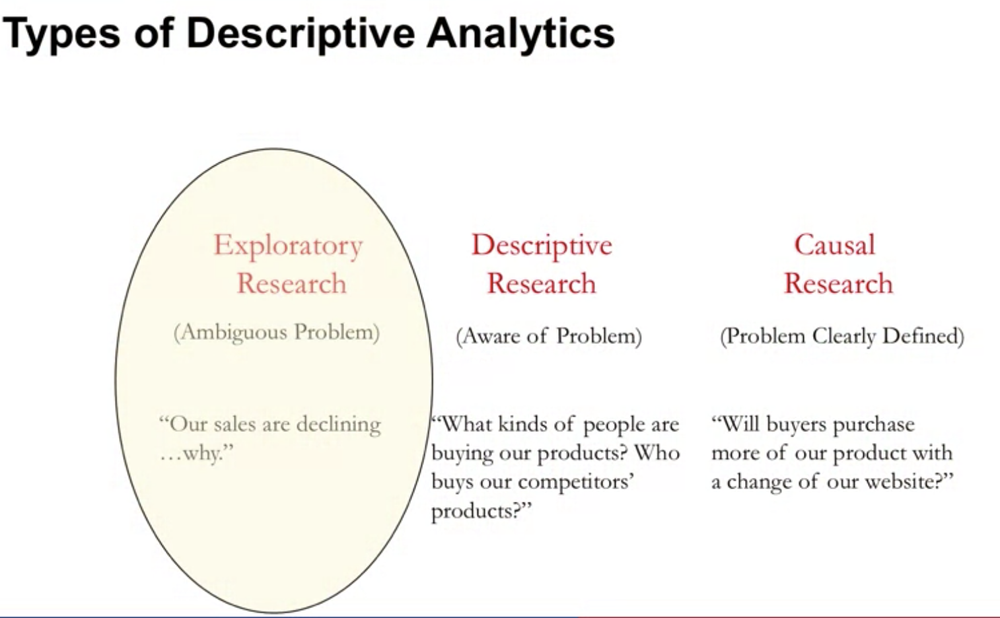
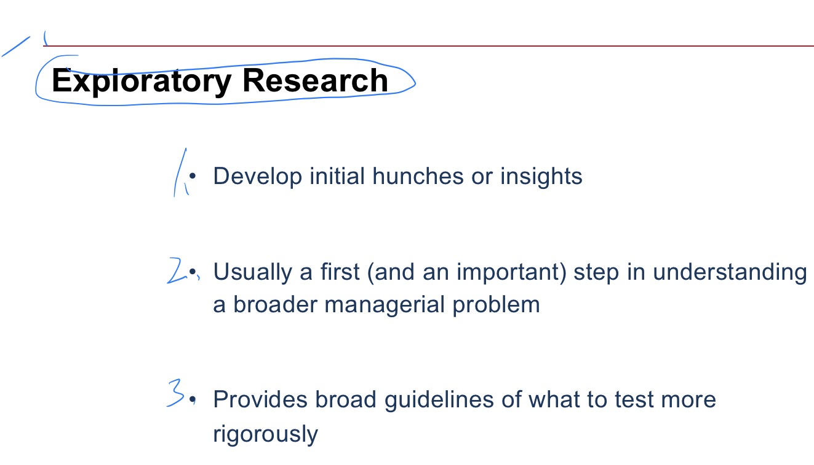
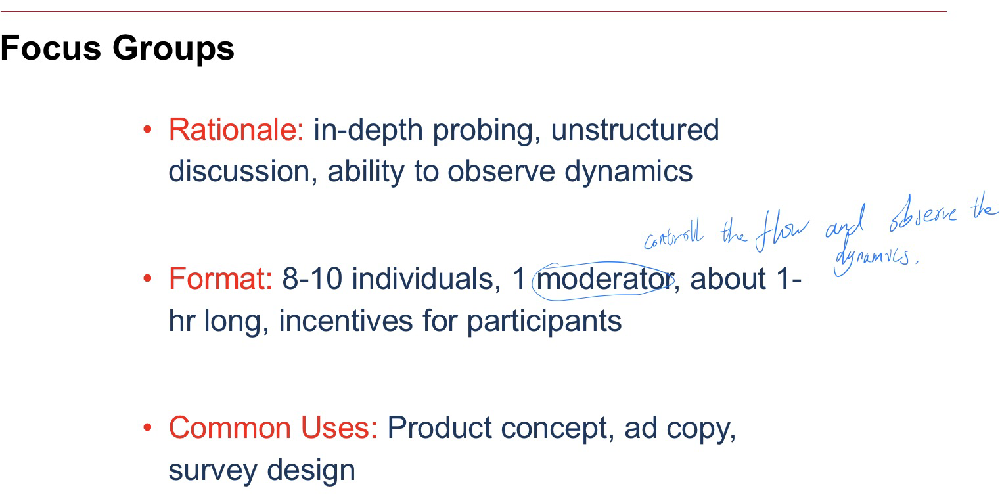
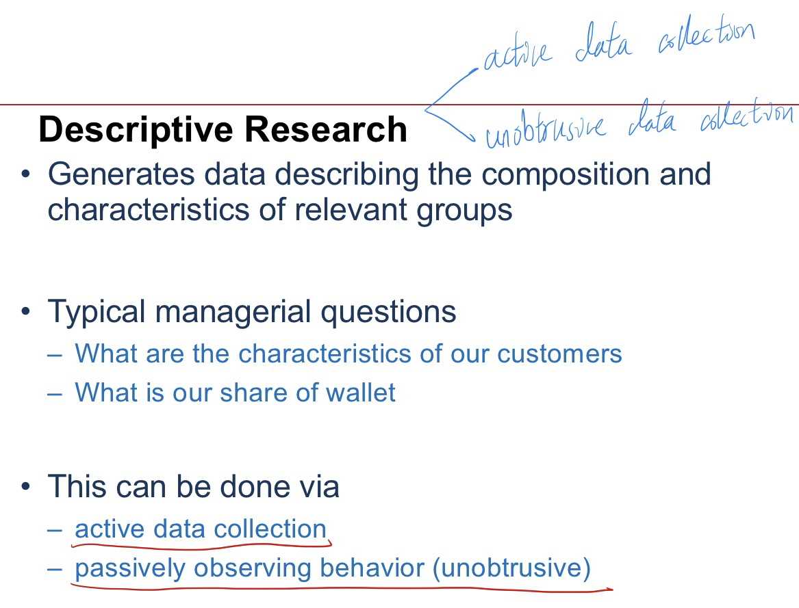
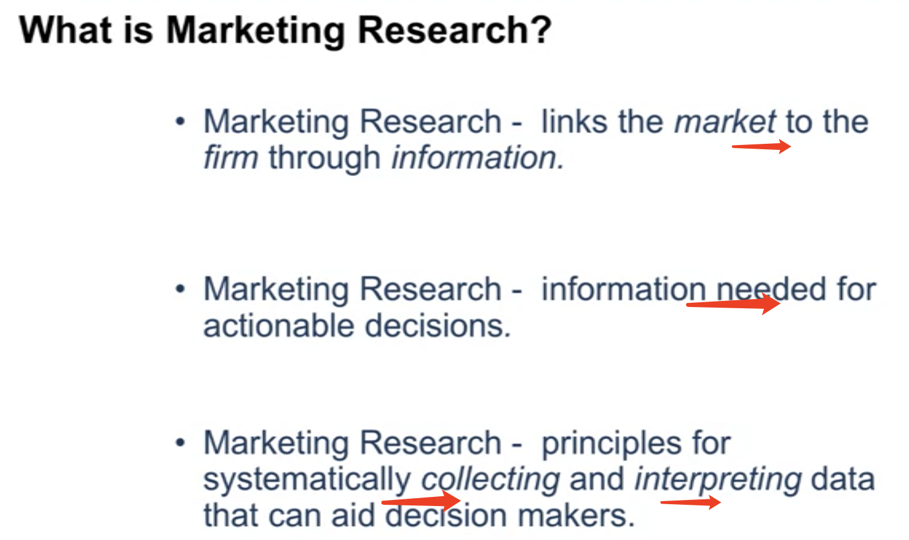

W2

## 1 What is Descriptive A

Common thread: Getting good data

The synergy between data and decisions that managers have to make that makes for good analytics.

From superficial to --- deeper

The type of data needed to be collected changed

-------

#### What type of question need to be answer, what types of data needed to answer those questions

##### <u>Exploratory Research</u>

- The typical technique that comes to mind is **Focus Group**
  
  
  
  
  
  --------

##### <u>Descriptive Research</u>

##### Active data collection 

- <u>**Surveys(There are reletative companies: (Qualtrics, Survey Monkey ) )**</u>

  **Type**:

  Regular one.

  Mobile Surveys.
  

  

<u>What kinds of questions can be arised be surveys?:</u>

  

- Self-reports of several types of consumer behavior

##### Unobtrusive data collection

# Summary of this week:

There diff data collection which go hand in hand with different types of marketing decisions.

- **Exploratory Research**:
  Focus groups, Internet communities
- Descriptive Research:
  Surveys, points of sales data
- Causal Research:
  Correlation, causation

## It's very important to keep the managerial goal and the type of data collection in mind, they are highly synergistic

Additional Reading :

### Clumpy
https://knowledge.wharton.upenn.edu/article/what-marketers-need-to-know-about-binge-buying/
### Predicting — and Monetizing — the Lifespan of a Tweet
https://knowledge.wharton.upenn.edu/article/predicting-and-monetizing-the-lifespan-of-a-tweet/
