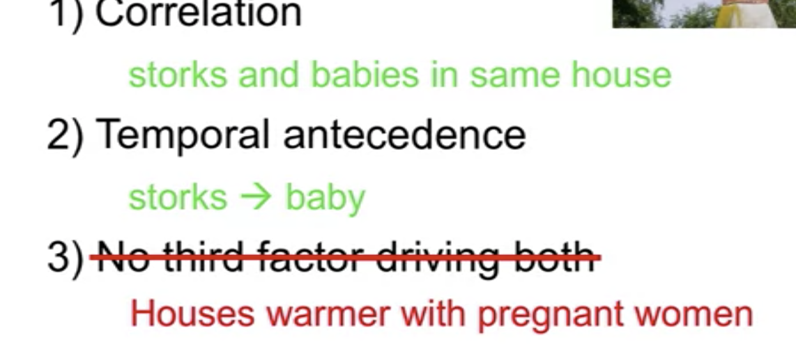

# Causal Data Collection

## Correlation and Causation

#### Causal Infrence 

- <u>Correlation</u>: Evidence of association between X and Y
- <u>Temporal antecedence</u>: X must occur before Y
- <u>No third factor driving both</u>: Contro of other possible factors

#### Example: storks bring babies.

Is there relation?Yes.  But is it causation?NO.

**A/B testing**: Start distinguishing between correlation and causation.
Landing page A versus B, how do you distinguish which page is better?

- One set of customers coming to your website, will see A
- Another set will see B
- The over time, you see the click trough rate.

Several companies help with A/B Testing: Optimizely, Leanplum

**Mobile A/B Testing**: which landing page better, which icon better

- Website optimization
- Mobile APp Design
- Customized design

