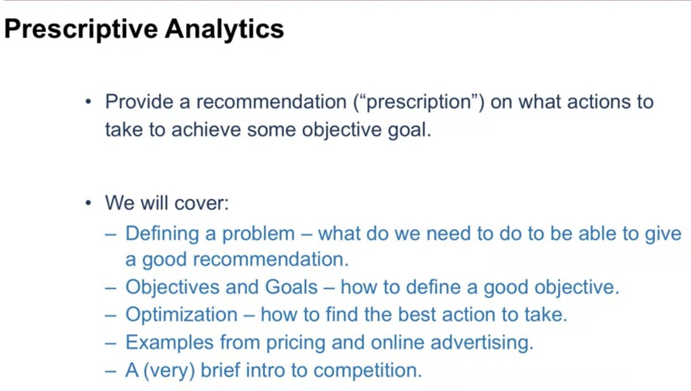
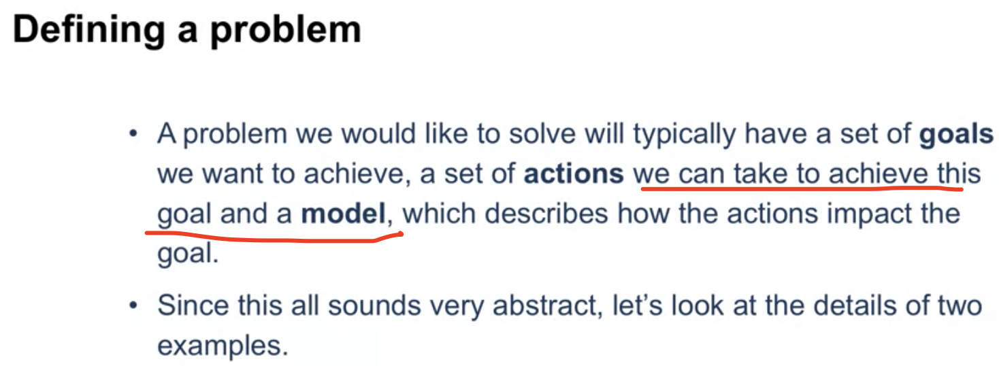
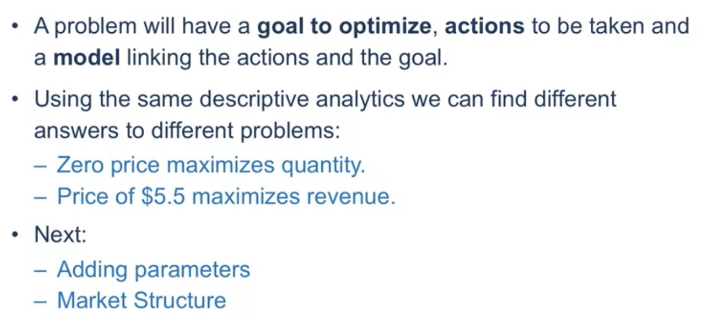
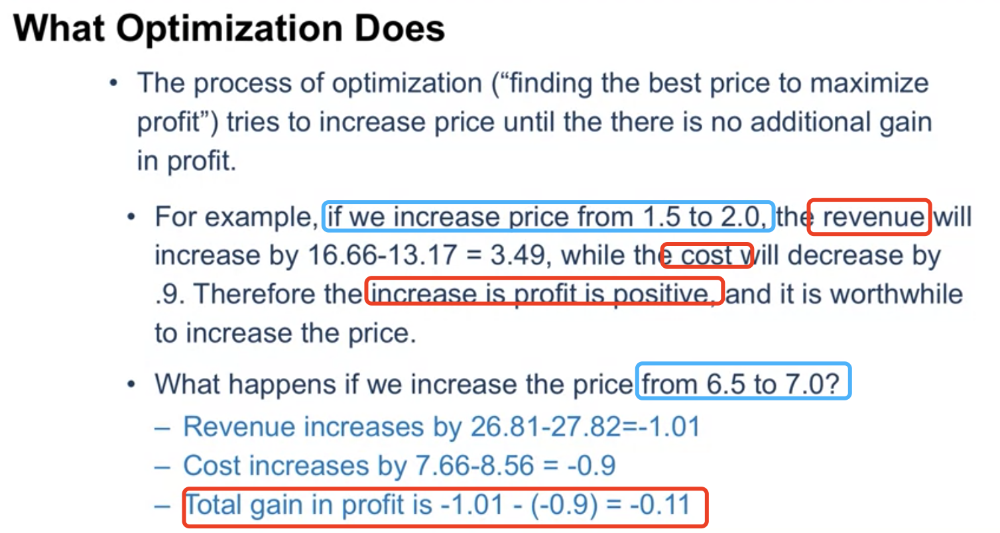

# Prescriptive customer Analytics

- Descriptive analysis: Collect data then try to map them to patterns you can understand in data
- Predictive analysis: Try to predict from consumer's past behaviour what they're going to do in the future.
- Given the predictions before then give the recommendation on what company needs to do in order to change the behavior of consumers

### 1. Defining a problem

- How can we sale the maximum quantity of products

- Maximize Revenue

  

### 2. Introduce more parameters: Maximizeing Profit

**What Optimization Does:**

- The process of optimization ("Finding the best price to maximize profit") tries to increase price until the there is **no additional gain in profit**.
  

**Profit maximization: Marginal Revenue(MR) = Marginal Cost(MC)**

- MR:How much we **increase in the revenue** by change the price of item by one unit
- MC:How much the **increase in the cost** by change the price of item by one unit

Making MR = MC

