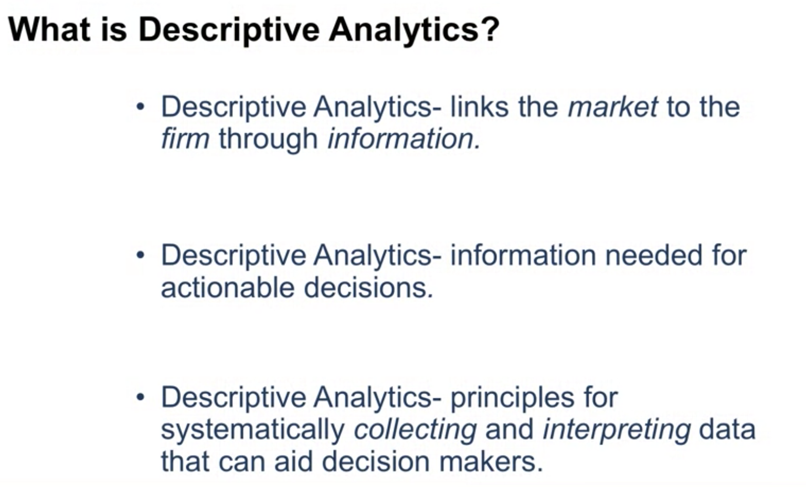
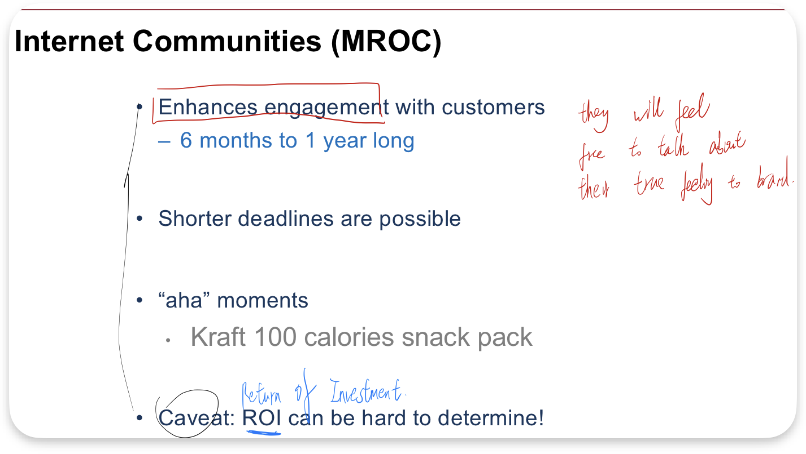

W2

## 1 What is Descriptive A

Common thread: Getting good data

From superficial to --- deeper

- Exploratory Research ----- Focus Group
  

# 2 Active Data Collection

- ## Survey

- ## Self-report of several types of the consumer behavior

