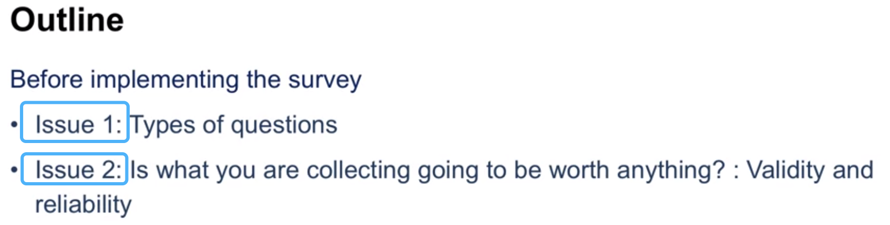
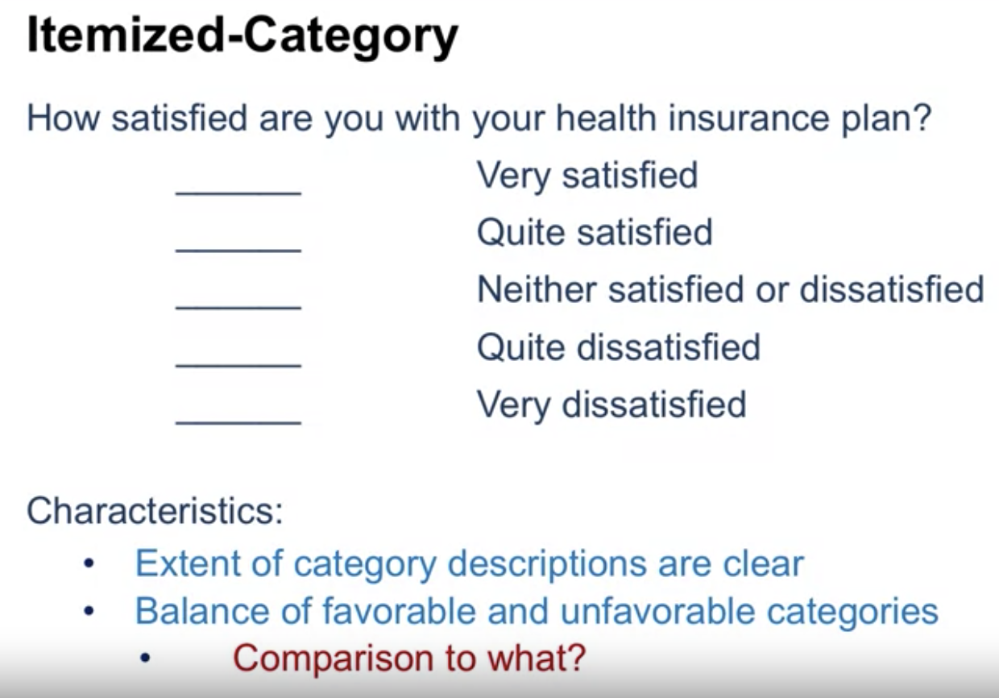
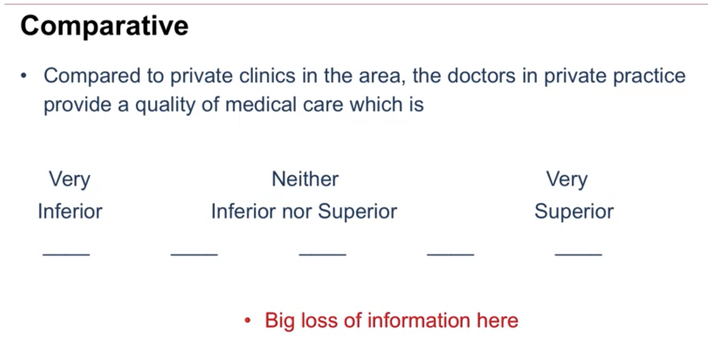
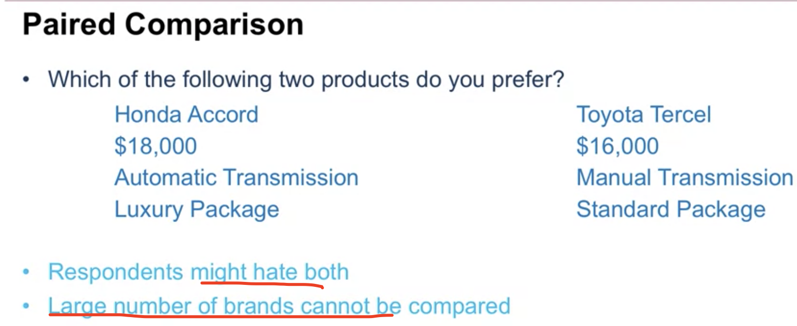
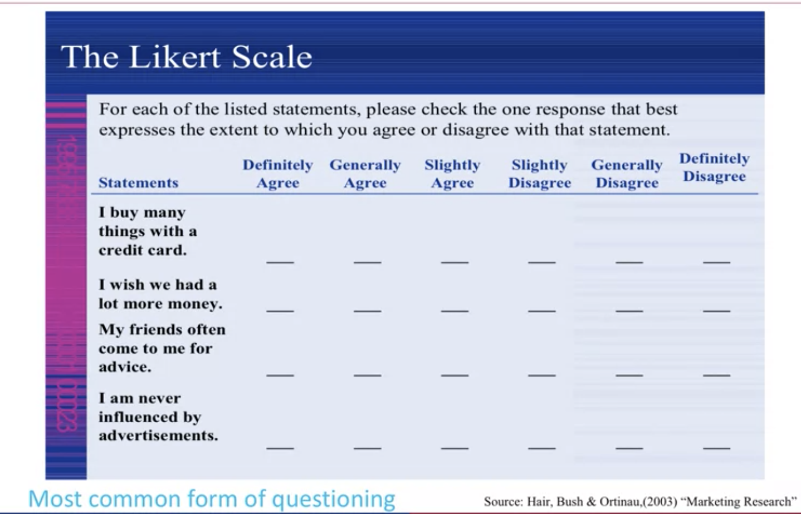
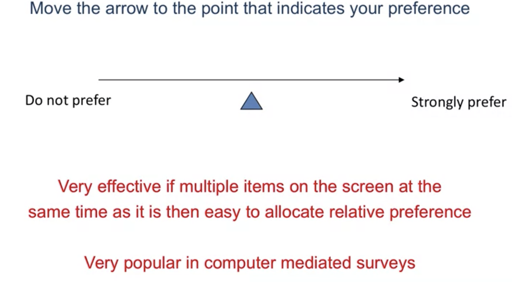
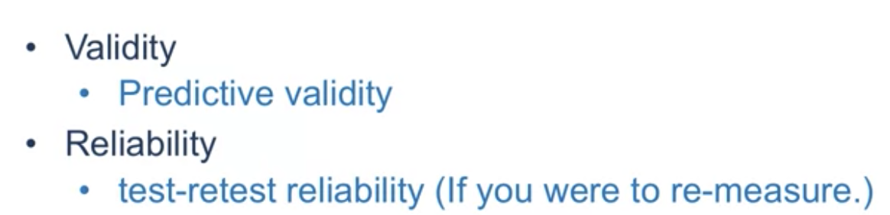
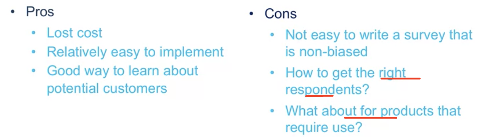

# 2 Descriptive Research Active Data Collection

- ## Survey

<u>**Surveys(There are reletative companies: (Qualtrics, Survey Monkey ) )**</u>  

#### Type:

Regular one.

Mobile Surveys.
  

### <u>What kinds of questions can be asjed be surveys?:</u>

#### 1. Issue1

  

##### 1.1 Itemised-category

##### 1.2 Comparative

What about both inferior

##### 1.3 Ranks

Ppl might focus on first several options then finish it casually.

##### 1.4 Paired Comparison

This is just like what ppl does in the real world.
3-4 are enough

##### 1.5 Likert Scale(most common)

##### 1.6 Continous

Easy to be done by computer mediated surveys

#### 2. Issue2: Is what you are collecting going to be worth anything? : Validity and reliability

1.Are able to be used to effect the future strategy
2.not very volatile

### Pros and Cons 

## 

