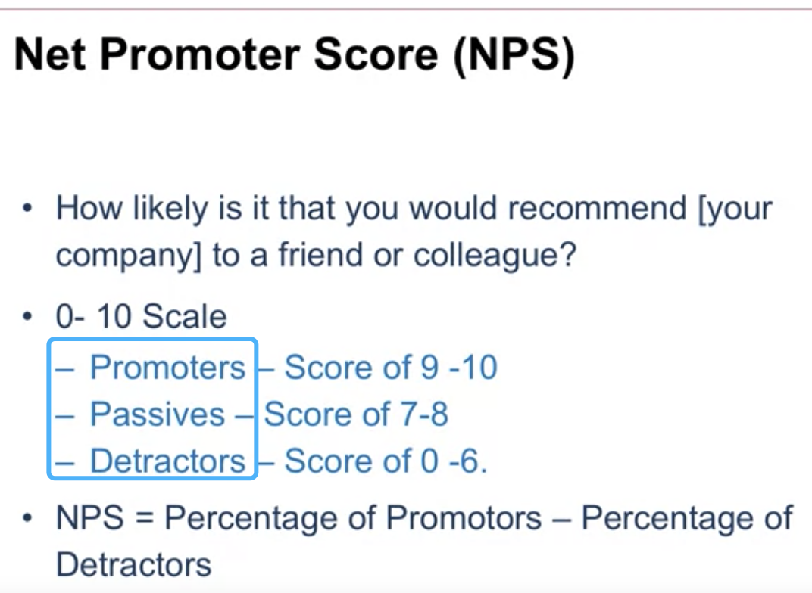
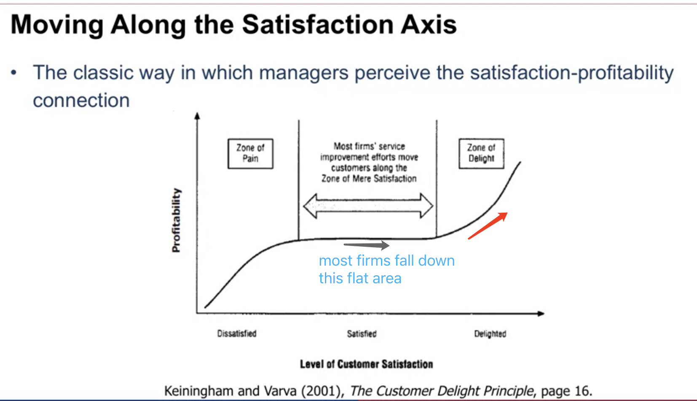

# DDC: Net Promoter Score and Self-Reports

#### A particular type of survey: Net Promoter Score

Boil down to one question: How likely is it that you would recommend a particular brand,

### NPS

NPS well captures the overall customers' satisfaction 

> But when implement NPS in company, remember there are better measures (for example: ASCI index with higher R^2)

#### Is NPS Related with Profitability

Yes: But the link is waker than what managers generally think

<u>And in fact it is much more complicated:</u>

<u>Think about those before implement the survey:</u>

## Self-Reports

- Store when purchases happen
- Word-of-mouth dynamics(Panel of Customers)

