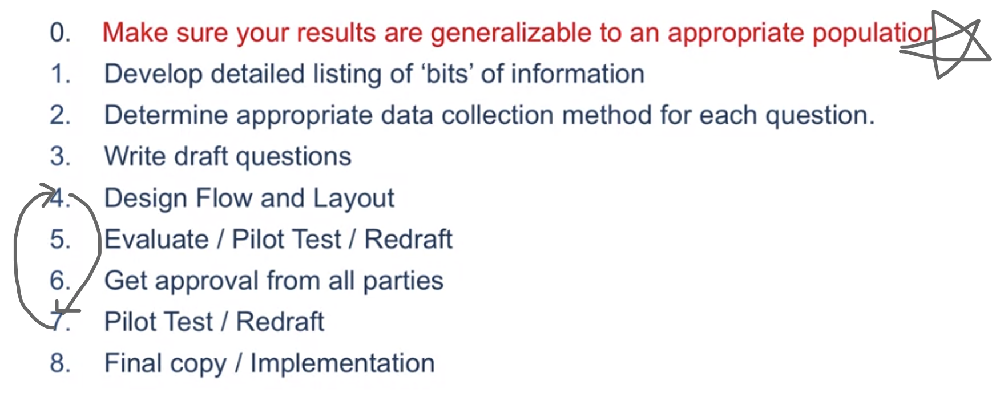
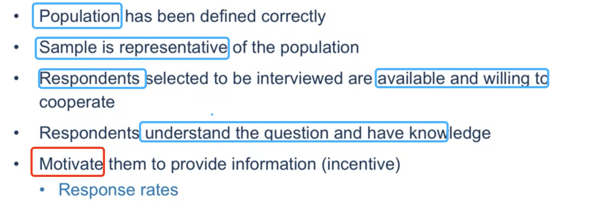
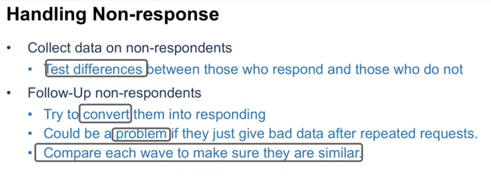
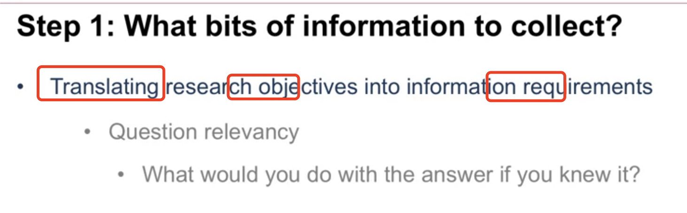
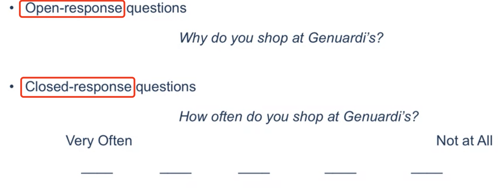
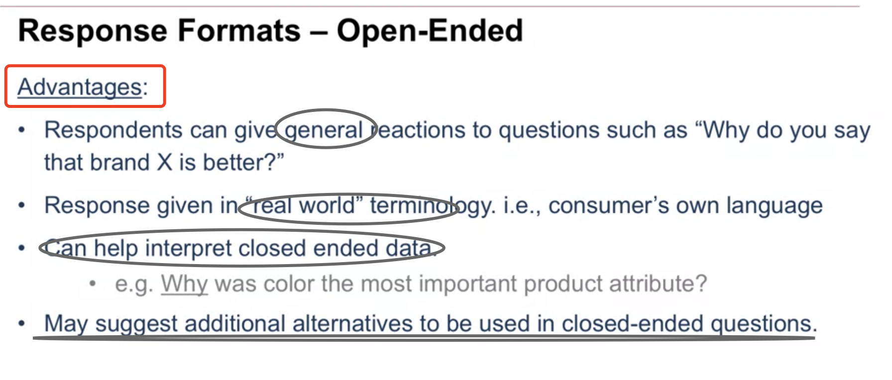
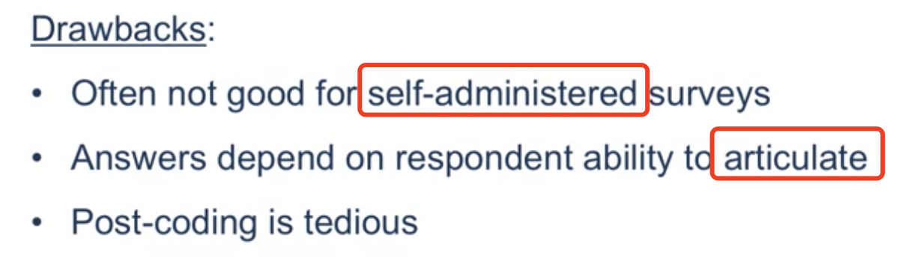
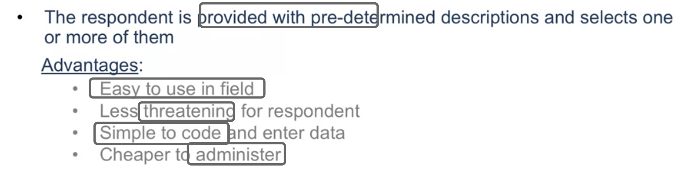
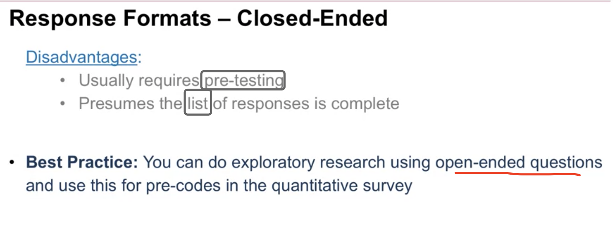

# DDC: Survey Design

## 1 Steps in Survey Design

#### 1.0 Ensure the data you get will be useful

#### 1.1 What bits of information to collect?

#### 1.2 How to measure the bits of information: Formatting the Qestion

<u>Advantages</u>

<u>Drawbacks</u>

Close-ended: Advantages

Close-ended: Drawbacks

