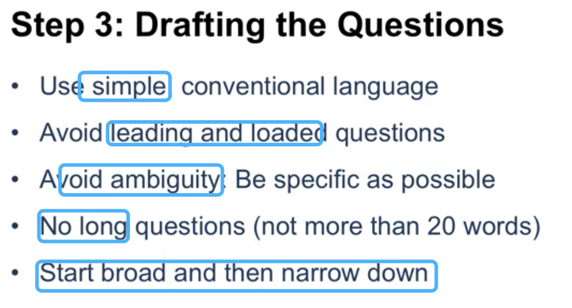
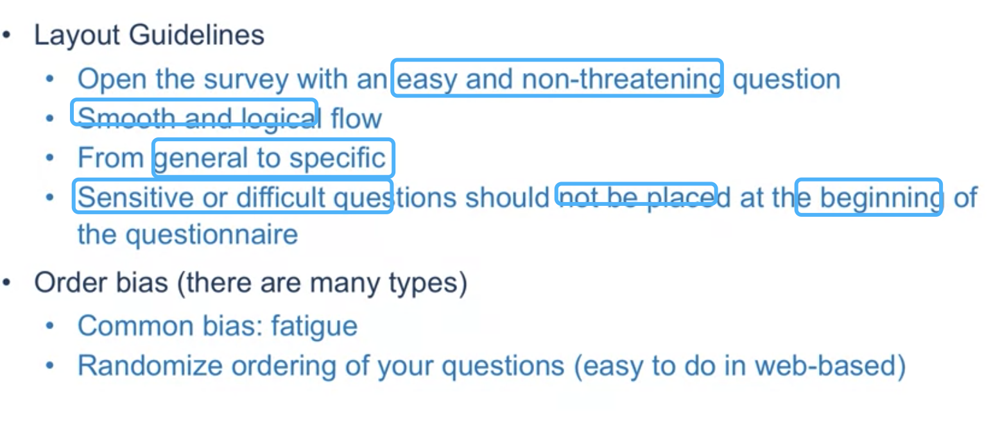
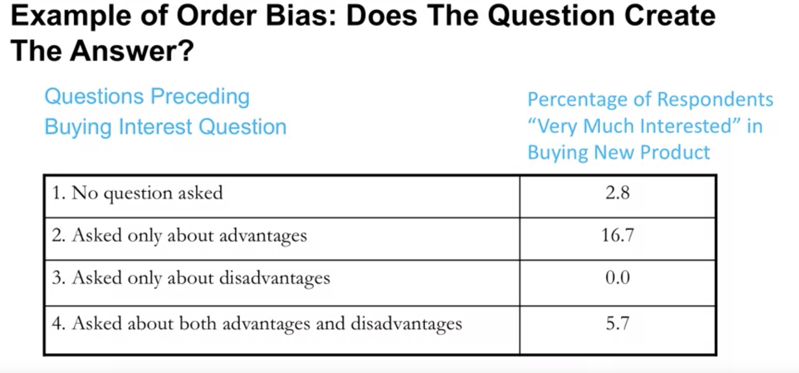
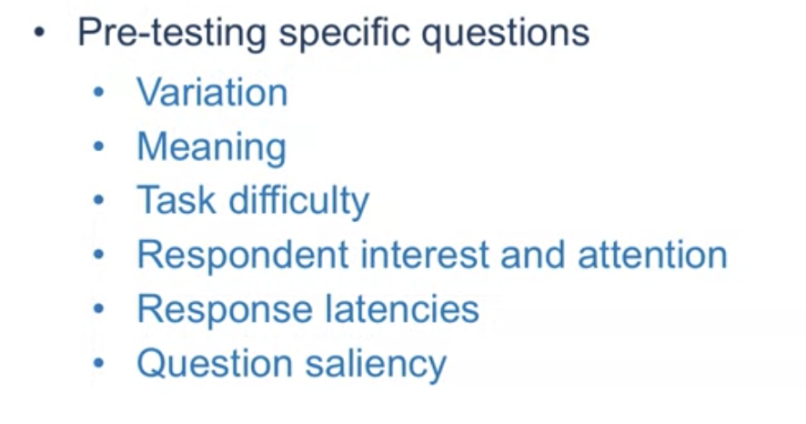

# DDC: Survey Design

## 1 Steps in Survey Design

#### 1.0 Ensure the data you get will be useful

#### 1.1 What bits of information to collect?

#### 1.2 How to measure the bits of information: Formatting the Qestion

<u>Open-Ended: <u>Advantages</u>

<u>Open-Ended: Drawbacks</u>

Close-ended: Advantages

Close-ended: Drawbacks

#### 1.3: Drafting the Questions

#### 1.4 Sequence and Layout Decisions

**Try to randomize ordering of questions to avoid order bias**

#### 1.5 and 1.7: Pre-testing and Correcting Problems

### Summary

- Conduct a mini "Market research" when designing a questionnaire: 
  think carefully about every question: how to design; how to order; how to ask; what language be used;
- Search for and use proven question: 
  there are many proven classic quesiton can be used to reduce your workload.
- Pretest questionnaire.

