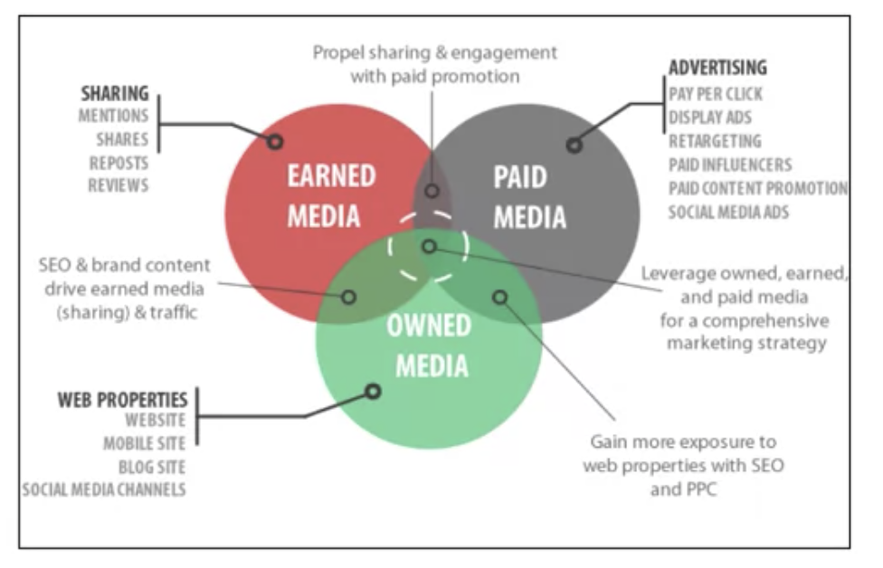

# Media Planning

How company go ahead and collect data. Sometimes themself sometimes by the aid of other company.

Kantar Media, Nielson Audio
How popular the TV show, how popular the channel.

### 1. What kinds of question can be answered with this <u>TV data</u>

- who is watching what show?
- how is the viewership pattern changing overtime? --> how should i spending diff money on diff types of ads in these Tv shows?
- TV viewership --> Ads Spend

### 2. <u>Social media</u> analytics

Hootsuite a company: collection data from twitter and Facebook.
What **questions** can be answered with **social media** data:

- **Audience engagement for a compaign**: If i running a comapign on FB, give me a sense on <u>**how good that compaign**</u> is.
- **Brand mentions as compared to competitor**s
- **Sentiment analysis**: Mentation in a good or bad way

### 3. Web data

- what happening on my website ;
  what products get popular
- what happening on maket place ;
  on yout copetiter

Company: te.com, comScore

### 4. mobile data

- Is the customer suearch on the mobile platform diff from the desktop?
- What information to show customers based on their location
- Location-based coupons

The way of thinking, a customer centric approach.
What are my customers and potential customers doing?
<u>BEING CUSTOMER-ORIENT</u>

