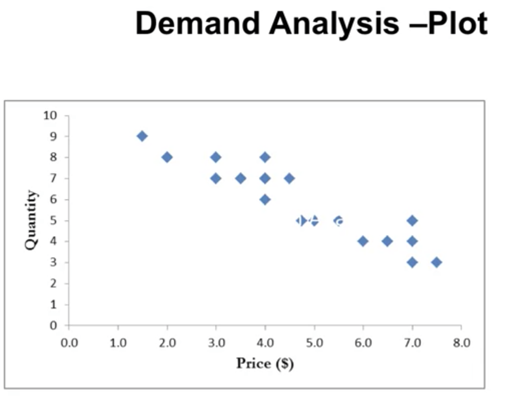
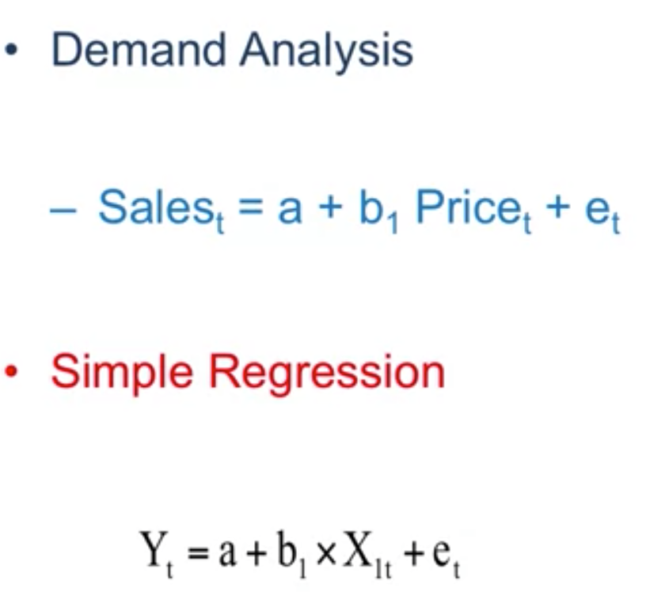
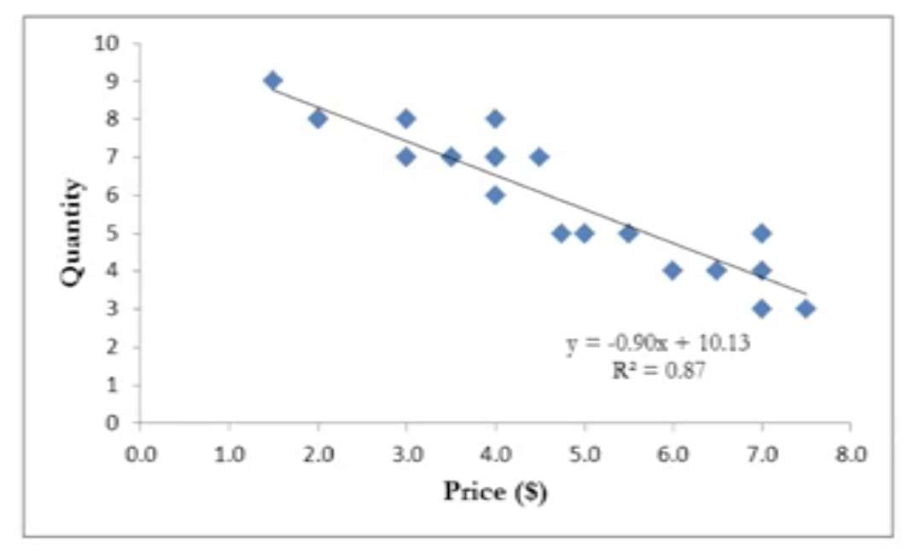
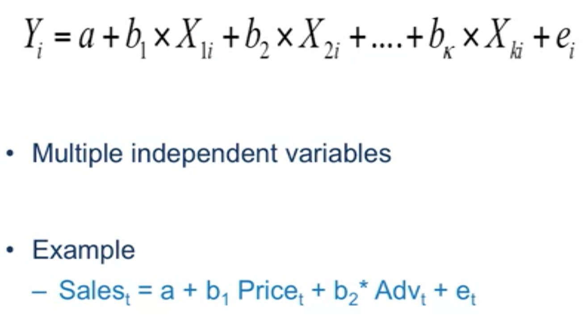
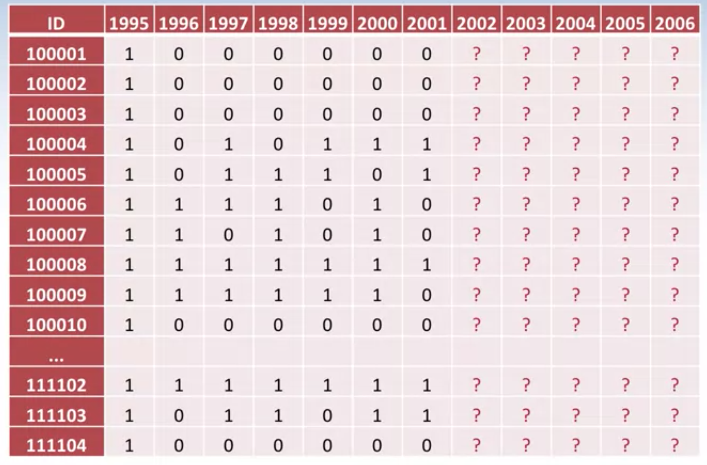
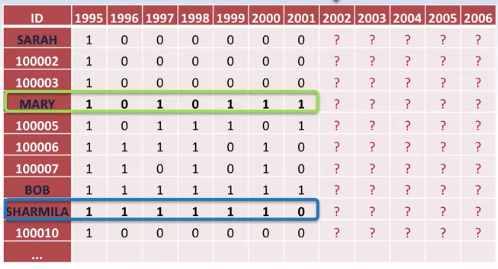

Predictive Analytics

## Intro

### From the former classes, got the sense the kinds of information customers left about themselves.

### Now Im gonna learn how to take these data to predict the future. 

### Techniques and Tools: which tools I am gonna use under the particular circumstance.

## Regression Analysis(1)

- Making prediction **one period** ahead [<u>In this modual, we are gonna talk about first one</u>]
- Making prediction two periods ahead

## What is the purpose of regression

- Quantify the relationship among two or more variables

### Demand analysis, example for regression 

If i increase price by 1 dollar, how much the sales come down?

- Price-Demand example
  

## Regression Analysis(2)

## Signal regression

When price goes up, the sales goes down. R2 is capturing how demand is changing with price. 0-1, Closer to 1 better. 0.7以上is great.

- As predictions can be done for diff prices, we can also determine optimal price.
- Optimal price - price that maximises overall profit
  - Intuition - for each price, we predict demand
  - Demand -> revenue and profit

## Multiple Regression

Sales won't be effect only by price but advertising, promotions.

#### Summary

- Regression is an ideal tool for understanding the drivers of demand and for demand predictions
- It can be used for determining optimal prices

# Beyond price

**RFM**: Recency, Frequency, Monetary Value.

### Examples: 
- In similar: A total chain, we have a bunck of people in our loyalty program. Did they stay in one of out properties or not in a given month?
- A credit card firm: Did these people have revolving interest charges or not on a month-to-month basis?
- A gaming app: Did ppl play the game or not on a day-to-day basis?

- A non-profit organize take track to their donors:
  
  
  So we'd better consider not only times of donate but "when"
  The SINGLE 0 carry a lot of weight Sharmila, it might means she no longer interested in our organisation.  People we chose Mary who this **Recency trumps Frequency** in this case

