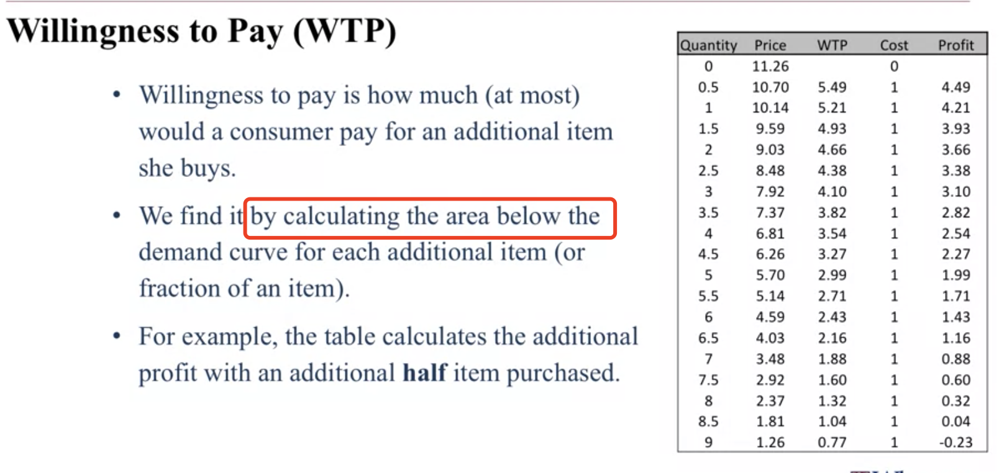
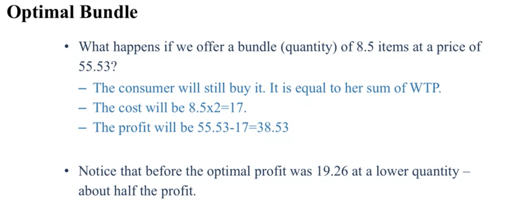

# Market Structure

**How** the different types of cunsumers and comapnies in the market actually affect our **choice of optimum price**?

 

Conclusion: If we know a little bit whether i<u>t's a signle consumer or multiple consumer,</u> and whether those consumers actually <u>want one item or two items</u>. We can choose whether to sell them **bundles** which will increase our profit.

