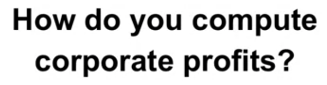
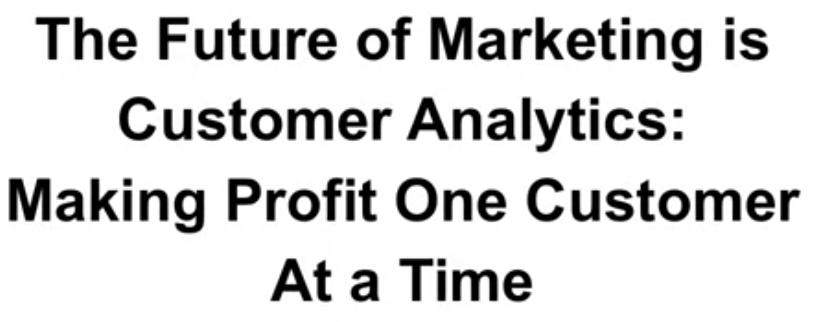
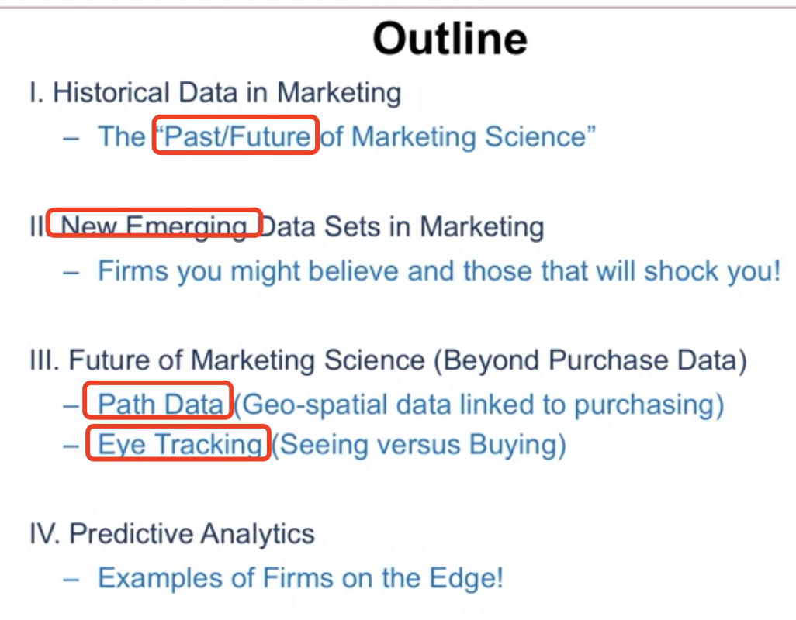
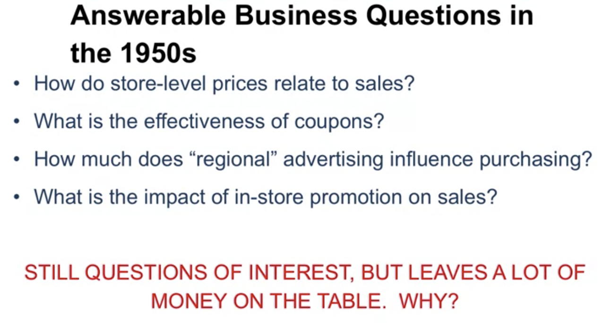
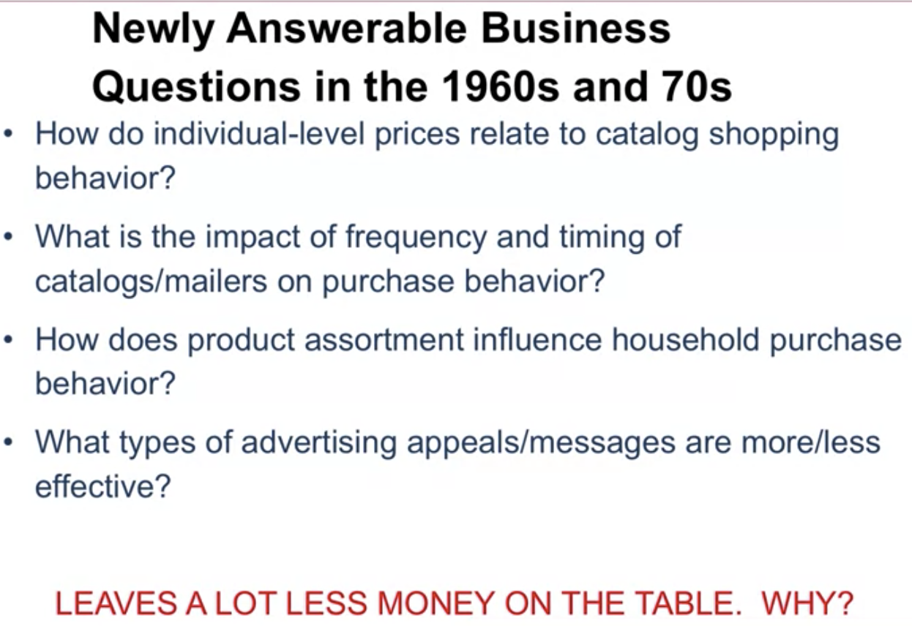
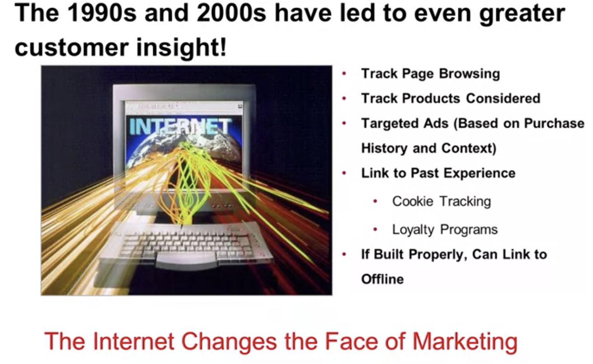
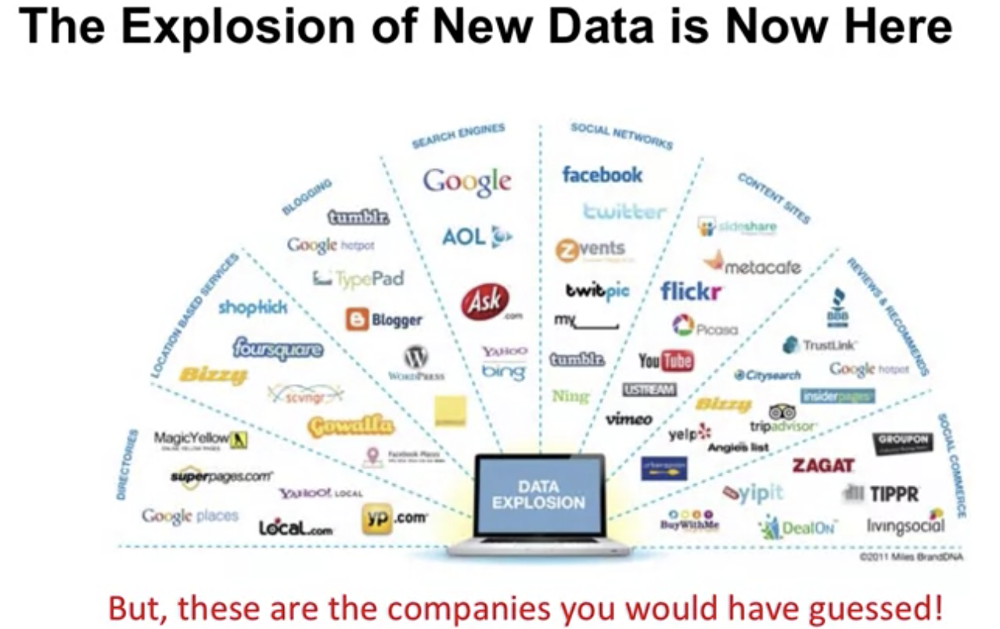
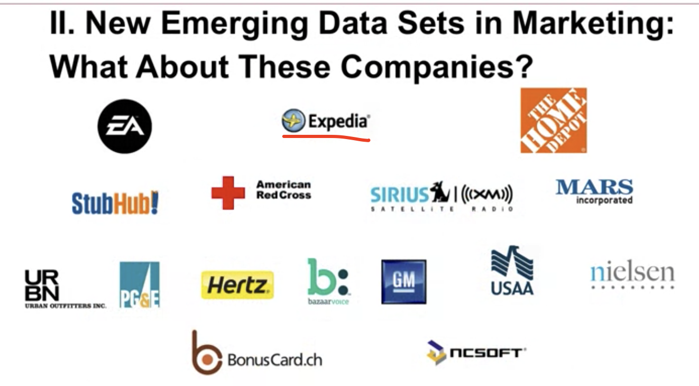

## 1.Intro:

1.1 Data: how to build a right intrustructure collect the right data

1.2 Always start with the basic **exploration** of the data. (When we show the idea of mine to stakeholders, the idea is supposed to come with data)

1.3 Prediction

1.4 Optimisation 

1.5 Decisions: take business action

## 2. The Future of Marketing is Business Analytics

2.1 

Make profit one customer at a time. (Instead of one product )

2.2 

**<u>What is "Customer Analytics"?</u>**

Customer analytics refers to the collection, management, analysis and strategic leverage of an organization's granular data about the behaviour(s) of its customers.

Customer analytics can be characterised as:

<u>Inherently granular</u>: a focus on individual-level behavior, not aggregate patterns

<u>Behavioural</u>: primary focus is on observed behavioural pattern(s), not demographics or attitudes.

<u>Forward-looking</u>: an orientation towards prediction, not just description

<u>Multi-platform</u>: desire to combine behaviors from multiple measurement systems

<u>Broadly applicable</u>: the definition of a "customer" is industry agnostic - it could be a user, reader, visiter, donor, client, etc

<u>Multidisciplinary</u>: relevant fields include marketing, statistics, computer science, information science, and operations research.

## 3. The Golden Age of Marketing

## 4. Applications: ROI( return of investment )

One of the most important question ppl wanna ask: the advertising attribution problem(how much is each piece of advertising worth)

## 5. Radically New Data Sets in Marketing

 
