# DDC: Survey Design

## 1 Steps in Survey Design

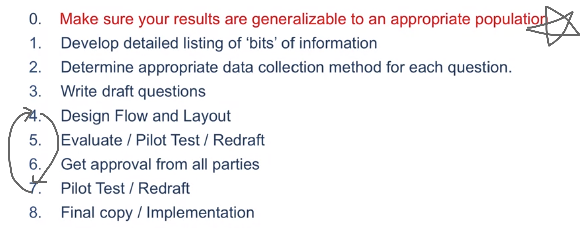

#### 1.0 Ensure the data you get will be useful

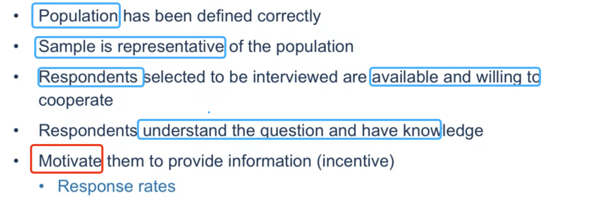

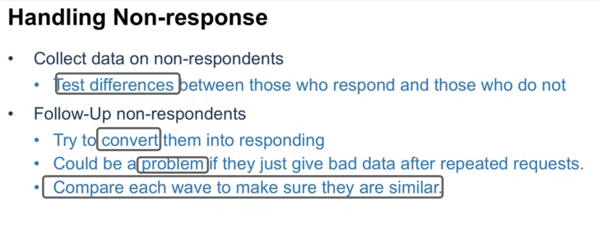

#### 1.1 What bits of information to collect?

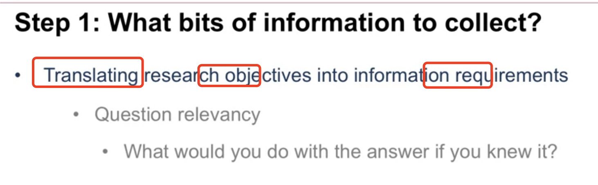

#### 1.2 How to measure the bits of information: Formatting the Qestion

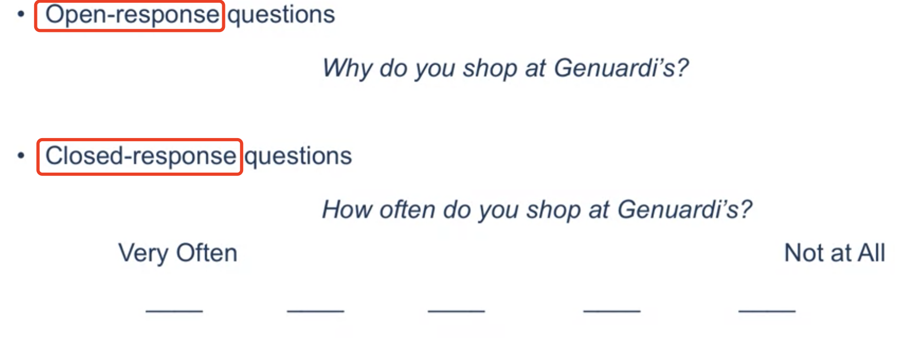

<u>Open-Ended: <u>Advantages</u>
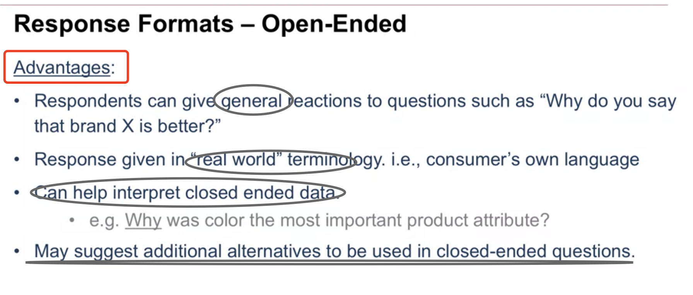

<u>Open-Ended: Drawbacks</u>
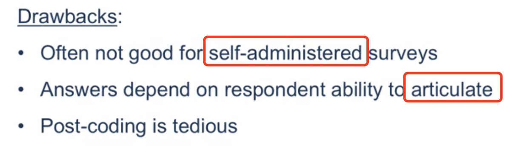

Close-ended: Advantages
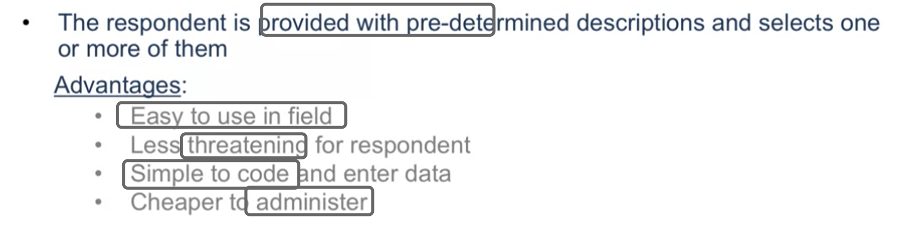

Close-ended: Drawbacks
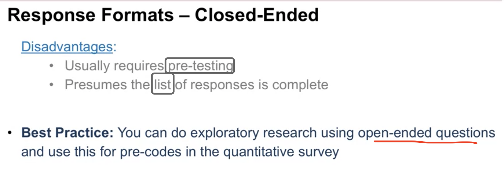

#### 1.3: Drafting the Questions

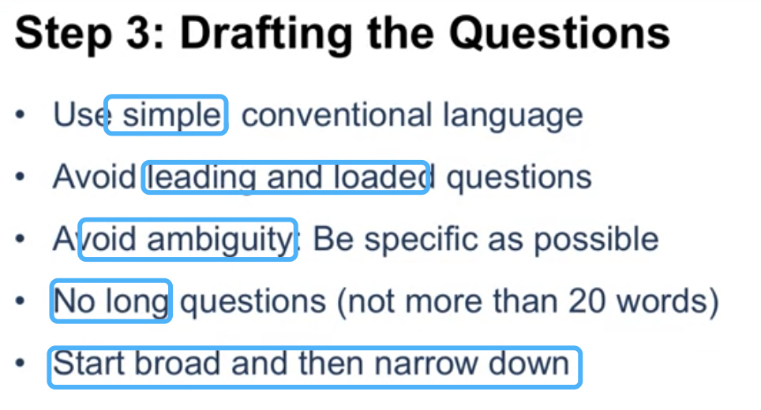

#### 1.4 Sequence and Layout Decisions

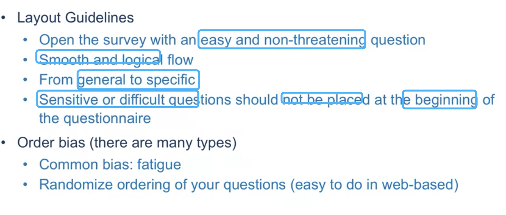

**Try to randomize ordering of questions to avoid order bias**
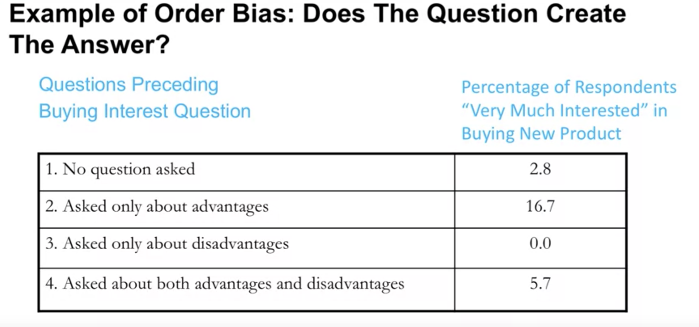

#### 1.5 and 1.7: Pre-testing and Correcting Problems

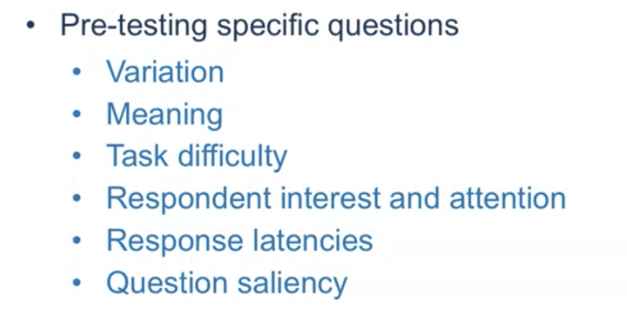

### Summary

- Conduct a mini "Market research" when designing a questionnaire: 
  think carefully about every question: how to design; how to order; how to ask; what language be used;
- Search for and use proven question: 
  there are many proven classic quesiton can be used to reduce your workload.
- Pretest questionnaire.

