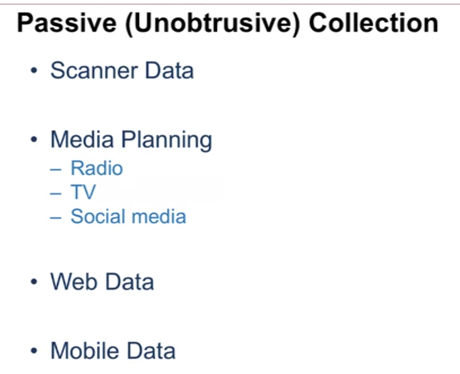
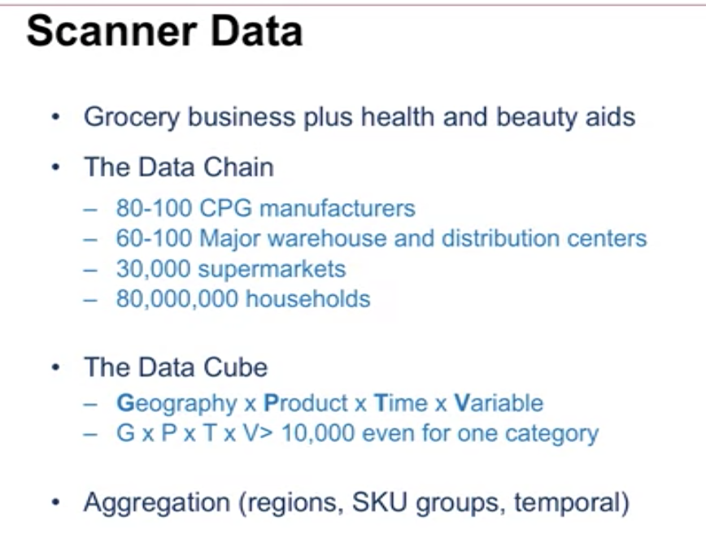
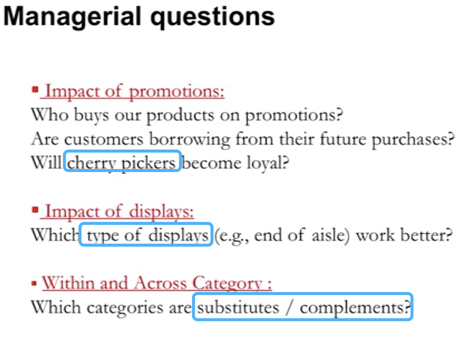
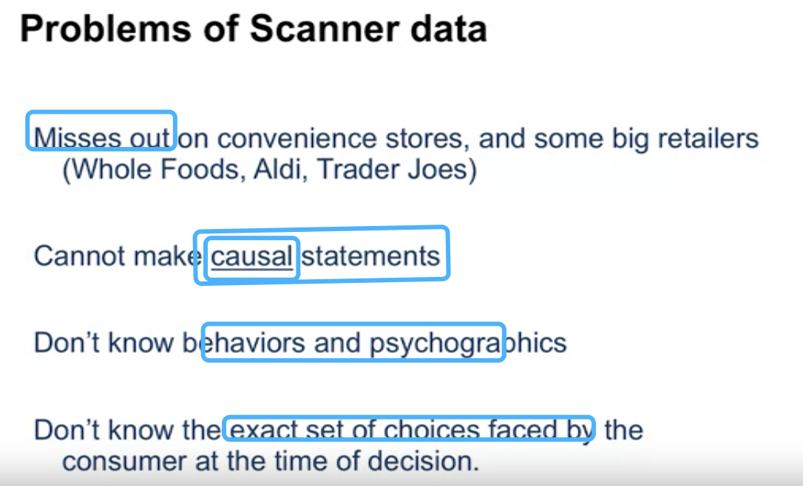

# Passive(Unobtrusive) Data Collection

### 1.Scanner Data:

some companies offer points of sales data(POS)

- nielsen
- iRi
- Spins

### Why POS data important :

- **By POS data** people can link aggregate sales to marketing instruments:
- **Timeliness**
- **Accuracy**
- 

#### Problem of Scanner data:

