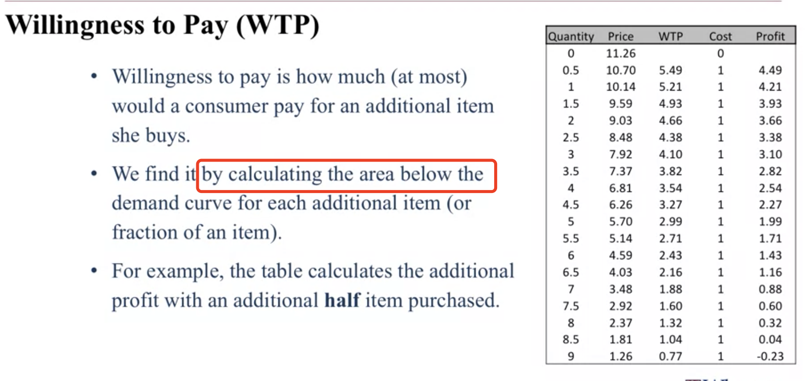
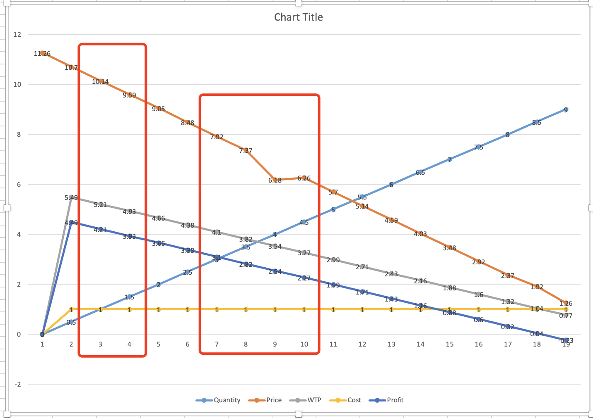
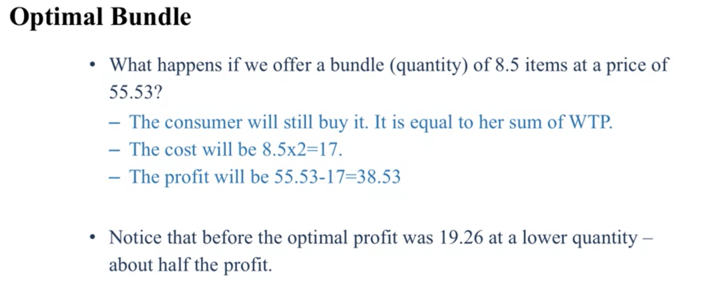
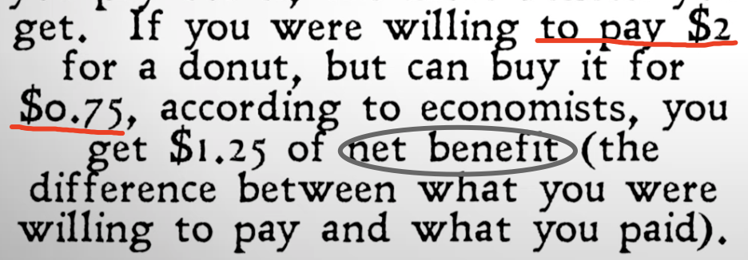
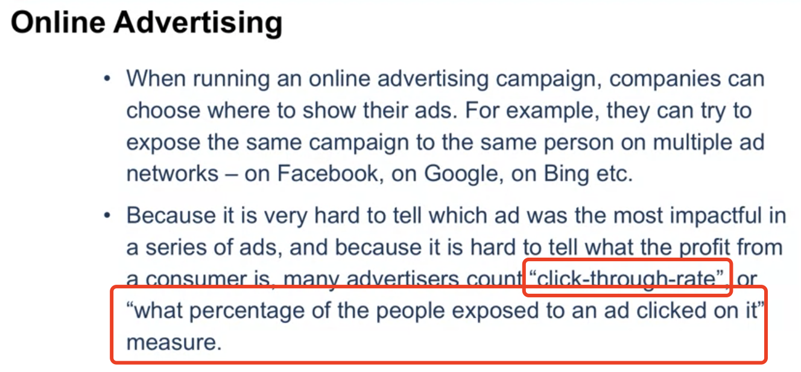
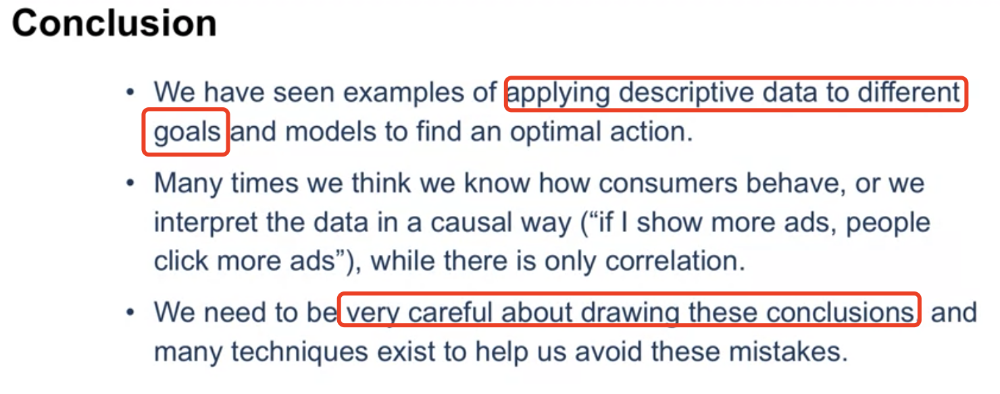
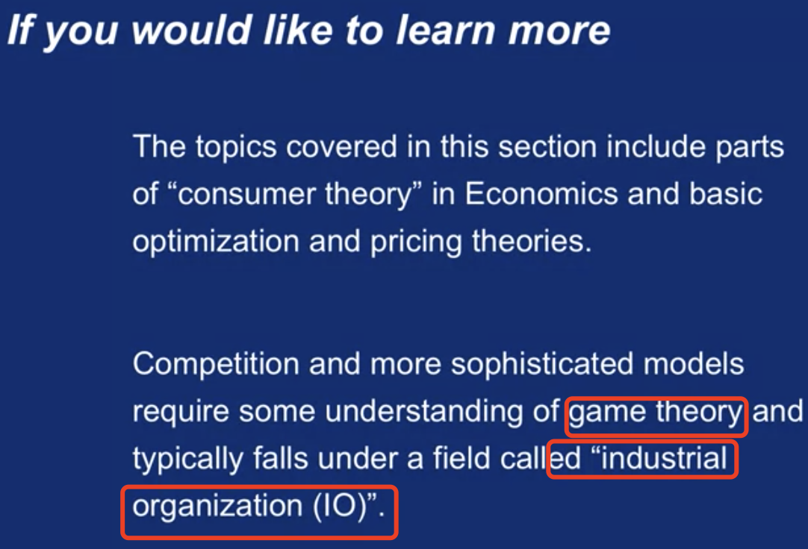

# Market Structure

**How** the different types of cunsumers and comapnies in the market actually affect our **choice of optimum price**?

 

Conclusion: If we know a little bit whether i<u>t's a signle consumer or multiple consumer,</u> and whether those consumers actually <u>want one item or two items</u>. We can choose whether to sell them **bundles** which will increase our profit.

### WTP(Willingness to pay)

- Helping businesses set prices

# Competition and Online Advertising Models

**Revision**:

- Goals, actions, models
- How to change the model to impact the actions within the same dataset.

It's crucial to ask the right question - let's move on

### Competition

**Strategic interaction**: We lower price, competitors lower price, we lower again, they.....  And this is what the field of **game theory** typically handles and tries to solve

### Online Advertising

CTR

## Conclusion

### Leran more

| Key terms  |      |
| ------------- | ------------- |
|           |      |
|           |      |
|           |      |
|           |      |
|           |      |
|           |      |

