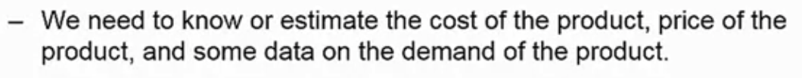
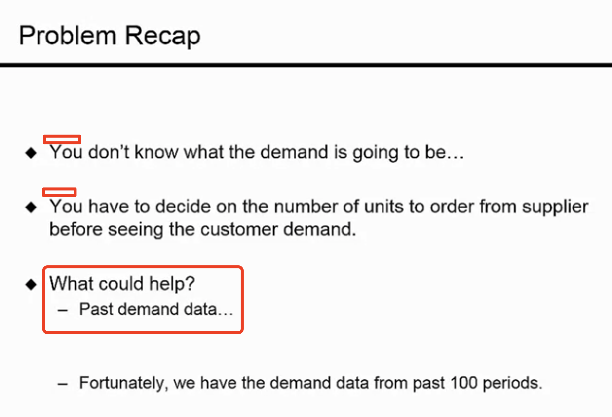

Notes_1

## First week: Descriptive Analytics

**Session1**: An Operational Decision Problem

**Session2**:
Forecasting with Past Historical Data
Moving Averages
Exponential

**Session3**:
Thinking about Trends and Seasonality

**Session4**:
Forecasting For New Products
Fitting Distributions

#### An operations problem: How much to produce? 

Newsvendor problem.

